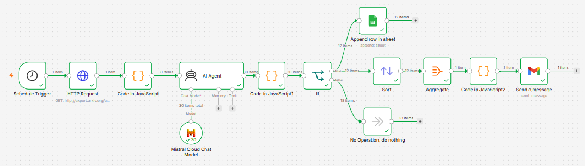

# AI Research Paper Discovery Agent
An automated n8n workflow that discovers, scores, and summarizes the most relevant AI/ML research papers from arXiv — delivering a daily digest via email and logging results to Google Sheets.

## Problem it solves
Keeping up with new AI/ML research is time-consuming. This agent automates the discovery and triage process, surfacing only the most relevant, high-impact papers instead of requiring manual review of dozens of new arXiv submissions every day.

## How it works
1. **Schedule Trigger** — runs daily at a set time
2. **HTTP Request** — fetches recent papers from the arXiv API across multiple categories (AI, ML, Computer Vision, NLP, biomedical imaging)
3. **Code node** — parses the raw arXiv XML/Atom feed into structured JSON (title, abstract, authors, link, publish date)
4. **AI Agent (Mistral LLM)** — reads each paper's title and abstract, writes a short summary, and scores its relevance (1–10) against a calibrated rubric tailored to the student's research interests
5. **Code node** — safely parses the AI Agent's JSON output and merges it back with the original paper metadata, with fallback handling for malformed responses
6. **Conditional filtering (IF node)** — routes papers into two branches based on whether their relevance score meets the threshold
7. **Google Sheets node** — logs every qualifying paper as a row for long-term tracking and reference
8. **Sort node** — orders qualifying papers by score, highest relevance first
9. **Aggregate + Code node** — compiles all qualifying papers (ranked) into a single, clean, formatted digest
10. **Gmail node** — sends the digest as one formatted email, rather than a separate email per paper
11. **No Operation node** — non-qualifying papers are simply discarded, no further action taken

## Architecture diagram

## Tech stack
- **n8n** — workflow orchestration and automation
- **Mistral AI** — LLM used for summarization and relevance scoring
- **arXiv API** — source of daily research papers
- **Google Sheets API** — persistent log of all qualifying papers
- **Gmail API** — daily digest delivery

## Key design decisions
- **Calibrated scoring rubric:** early iterations of the prompt caused score inflation (the LLM rated almost everything highly). The prompt was rewritten with an explicit 1–10 rubric and instructions to be a strict, selective reviewer, which produced a much more meaningful score distribution.
- **Single combined interest area:** the prompt explicitly instructs the model to treat all of the student's research interests (AI, ML, DL, CV, biomedical AI, healthcare AI, NLP, RAG) as one combined area rather than scoring them separately — an earlier version of the prompt caused the model to return a score broken down by sub-topic instead of one overall number.
- **Digest over individual emails:** instead of sending one email per matching paper (noisy and unprofessional), all qualifying papers for the day are aggregated, sorted by relevance, and delivered as a single formatted digest email.
- **Defensive JSON parsing:** the LLM's output is parsed with fallback handling — if the response isn't valid JSON, or if a field arrives in an unexpected shape (e.g. an object instead of a number), the pipeline still produces a usable, numeric score rather than failing.

## Setup
1. Import `workflow.json` into your n8n instance
2. Add credentials for Mistral AI, Google Sheets, and Gmail
3. Update the arXiv query in the HTTP Request node to match your field of interest
4. Update the research interest description in the AI Agent prompt
5. Create a Google Sheet with columns: `Title | Summary | Score | Link | Authors | Date`, and connect it in the Google Sheets node
6. Set your own email address in the Gmail node
7. Activate the workflow

## Author
Javeria Javed
